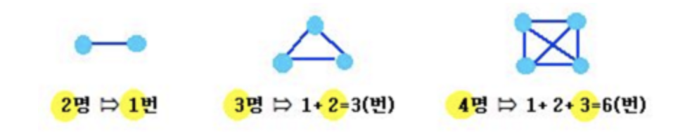

# 리그 경기 횟수 구하기

## 문제 설명
리그에 속해있는 팀의 수 n이 주어지고 각 팀은 자신을 제외한 모든 팀과 한 경기 씩 치루어 순위를 가리는 스포츠 리그전에서 치루어지는 경기의 수를 구하는 프로그램을 작성하십시오.

2팀이면 1경기, 3팀이면 3경기, 4팀이면 6경기가 치루어 집니다. 



## 입력
리그에 참여하는 팀의 수

## 출력
리그에서 치루어 지는 경기의 수

## 입/출력 예시
입력           | 출력 
------------- | ---------
4 | 6     
10| 45

## solution 1
```javascript
const getTournament = (team) => (team * (team - 1)) / 2
```

* [조합](https://ko.wikipedia.org/wiki/%EC%A1%B0%ED%95%A9)을 알면 공식으로 구하기 쉽다. C(n,2)로 구할 수 있다. C(n, 2)를 공식으로 풀면, (n * (n - 1)) / 2 이다. 즉, 순서가 있는 경기 수를 구하면 n * (n -1)이다. 예를 들어, 3은 총 경기수가 3 * 2 = 6이다. a, b, c 세팀이면, (a, b), (a, c), (b, a), (b, c), (c, a), (c, b) 총 6경기이다. 하지만 (a, b)와 (b, a)는 같은 경기이기 때문에 2로 나누어 주어야 한다. 그렇기 때문에 (n * (n - 1)) / 2 이다.
