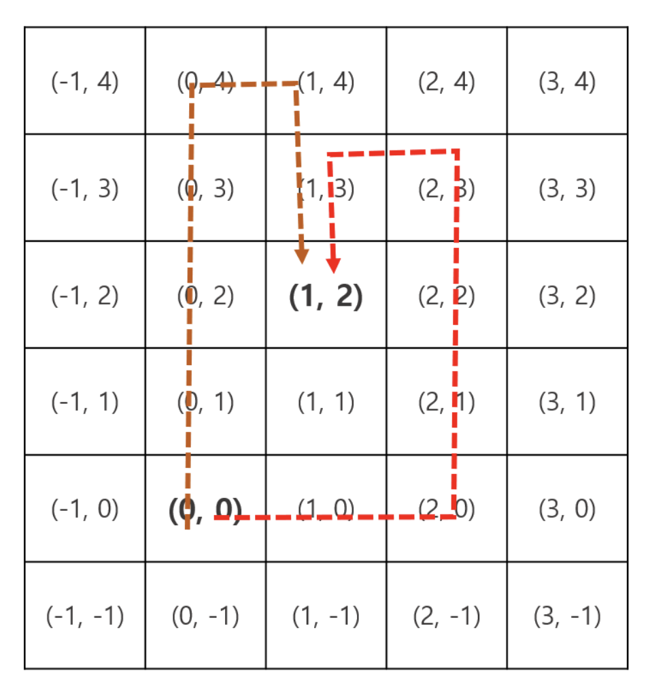

# 인공지능 청소기

## 문제 설명
준우는 이번에 홈쇼핑에서 홍보했던 로봇 청소기를 구매했다. 준우는 새로 산 로봇 청소기의 예약 청소 기능을 테스트해보려고 한다. 예약 청소 기능은 로봇 청소기가 자유롭게 주변을 청소하다가 사용자가 설정한 시간과 장소에 정확히 도착하는 기능이다. 원하는 시간과 장소의 좌표를 입력하면 다른 장소들을 임의로 청소하다가 정확히 도착 예정 시간에 해당 위치에 도착한다. 이 과정에서 동일한 위치를 두 번 이상 지나쳐서 청소할 수 도 있다. 준우는 다음과 같은 규칙 하에서 예약 청소 기능이 정확히 동작할 수 있는지 궁금해졌다.

* 준우의 집은 2차원 정수 좌표계로 표현할 수 있고 초기 로봇 청소기의 위치는 (0, 0) 이다.
* 로봇 청소기는 1초에 한 번 움직여야만 하며, 이 때 상하좌우 중 하나의 방향으로 1의 거리를 움직인다.
* 이미 청소하고 지나갔던 칸을 다시 방문해도 괜찮다.
* 준우가 정한 N초의 시간이 정확히 흐른 시점에 로봇 청소기는 (X, Y)에 위치해 있어야 한다.

 준우가 예약한 시간과 위치의 좌표가 입력으로 주어질 때, 로봇 청소기가 정확한 시간에 도착할 수 있는지 여부를 판단하는 프로그램을 작성하시오.


* 그림 1. (0, 0)에서 출발하여 (1, 2) 지점에 정확히 7초만에 도착하는 경로들의 예시

예를 들어서 준우가 (1, 2) 의 위치에 정확히 7초후에 도착하기를 예약했다고 가정해보자. 이 경우 로봇 청소기는 위의 예시와 같은 경로로 이동하여 7초후에 목적지에 도착 할 수 있다. 하지만 해당 위치에 정확히 1, 2초에는 도착할 수 있는 방법이 없다. 물론 정확히 8초에 도착하는 방법도 존재하지 않는다.

## 입력
첫 줄에는 테스트케이스의 수를 나타내는 1이상 10이하의 자연수 T가 주어진다. 이후 총 T개의 테스트케이스에 대한 입력이 차례로 주어진다

각 테스트케이스의 데이터는 공백으로 구분된 세 개의 정수가 `X Y Z`형식으로 한줄에 주어진다

* X, Y는 절대값이 10억이하인 정수다
* N은 1이상 20억이하의 자연수다

## 출력
각 테스트케이스에 대한 정답을 차례로 한 줄씩 출력한다.
* 정확히 N초 후에 로봇 청소기가 (X, Y) 좌표에 도착할 수 있다면 `YES`를 출력한다
* 그렇지 않다면 `NO`를 출력한다

## 입/출력 예시
입력           | 출력 
------------- | ---------
4<br>-5 -2 7<br>5 -5 2<br>0 5 6<br>1 2 7| `YES`<br>`NO`<br>`NO`<br>`YES`

## solution 1
```javascript
const strConvertArr = (str, seperator) => str.split(seperator)
const getTestCases = (testCaseSet) => testCaseSet.map((testCase) => strConvertArr(testCase, ' '))
const convertAbsoluteNumber = (strNum) => Math.abs(Number(strNum))
const checkedDestination = (testCase) => {
  const [X, Y, N] = testCase
  const absoluteX = convertAbsoluteNumber(X)
  const absoluteY = convertAbsoluteNumber(Y)
  const absoluteN = convertAbsoluteNumber(N)
  const checkingNumber = absoluteN - absoluteX - absoluteY
  if (checkingNumber < 0) return 'NO'
  return (checkingNumber % 2) === 0 ? 'YES' : 'NO'
}

const getAICleanerTest = (input) => {
  const inputArr = strConvertArr(input,'\n')
  const testCases = getTestCases(inputArr.slice(1))
  return testCases.map((testCase) => checkedDestination(testCase)).join('\n')
}

```

* 테스트 케이스에서 (0, 0)에서 (X, Y)까지 최소로 가는 시간을 구하고, 남은 시간이 짝수인지 아닌지 판단했다.