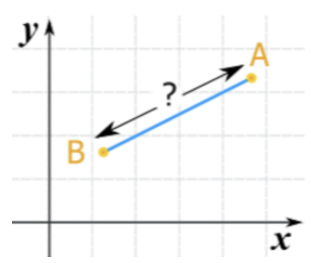

# 두 점 사이의 거리

## 문제 설명
점 두개 사이의 거리를 구하는 프로그램을 작성하십시오.


## 입력
첫 줄에 점1 의 좌표 ( x, y )

다음 줄에 점2 의 좌표 ( x, y )

## 출력
두점 사이의 거리 ( 소수점 2번째 자리까지 )

## 입/출력 예시
입력           | 출력 
------------- | ---------
10 100<br>100 10| 127.28
2 2<br>5 5 | 4.24

## solution
```javascript
const getDistance = (a, b) => Math.abs((a - b))

const getSquare = (n) => Math.pow(n, 2)

const convertNumberArr = (arr) => arr.map((strN) => Number(strN))

const getDistanceCoordinatePlan = (coordinateSet) => {
  const [point1, point2] = coordinateSet.split(`\n`)
  const [x1, y1] = convertNumberArr(point1.split(' '))
  const [x2, y2] = convertNumberArr(point2.split(' '))
  const horizontalDistance = getDistance(x1, x2)
  const verticalDistance = getDistance(y1, y2)
  const pythagoras = getSquare(horizontalDistance) + getSquare(verticalDistance)
  
  return Number(Math.sqrt(pythagoras).toFixed(2))
}
```

* 고등수학에서 좌표평면의 [두 점 사이의 거리를 구하는 공식](https://ko.wikipedia.org/wiki/%EB%91%90_%EC%A0%90_%EC%82%AC%EC%9D%B4%EC%9D%98_%EA%B1%B0%EB%A6%AC)을 이용했다. 그래서 공식을 구하기 위해서 Math함수를 이용했다.
