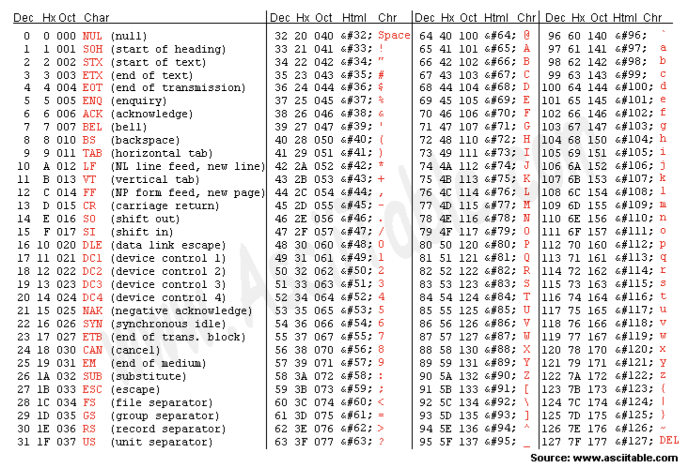

# ASCII 코드

## 문제 설명

*ASCII (**A**merican **S**tandard **C**ode for **I**nfomation **I**nterchange)

위는 미국 정보 교환 표준 부호인 ASCII 코드 표입니다.

임의의 문자가 입력되면 해당 문자에 해당하는 ASCII 코드 값을 출력하는 프로그램을 작성하십시오.

## 입력
임의의 문자

## 출력
입력 문자의 ASCII 코드 값(십진수)

## 입/출력 예시
입력           | 출력 
------------- | ---------
A | 65
a | 97


## solution 1
```javascript
const getASCIICode = (str) => `${`${str}`.codePointAt(0)}`
```

* [String.codePointAt](https://developer.mozilla.org/en-US/docs/Web/JavaScript/Reference/Global_Objects/String/codePointAt)을 이용하면, 간단히 해결 가능하다.
