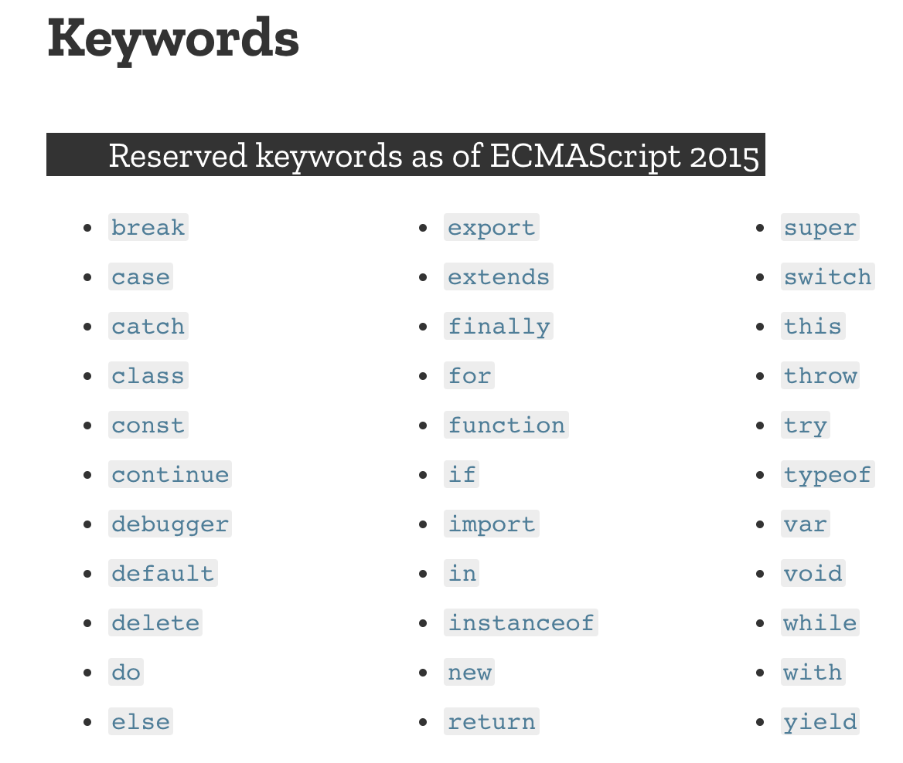

# 잘 모르고 있었던 것들

## 1. 이름
* 변수 이름의 길이 제한이 없기 때문에, 이름만 보고도 무엇을 하는 것인지 알 수 있게 변수명을 짓는다.
* 변수명은 소문자로 시작, 생성자 함수의 이름은 대문자로 시작(되도록 new를 사용하지 말기)
* 변수 이름에 예약어를 피하기

## 2. 숫자
* IEEE-754
* 0과 -0이 존재
* [Number.EPSILON](https://developer.mozilla.org/ko/docs/Web/JavaScript/Reference/Global_Objects/Number/EPSILON) - 1에 더했을 때 1보다 큰 수를 만들어 낼 수 있는 가장 작은 양수. 꼭 해석학의 엡실론같은 느낌..?
* [Number.MAX_SAFE_INTEGER](https://developer.mozilla.org/ko/docs/Web/JavaScript/Reference/Global_Objects/Number/MAX_SAFE_INTEGER) - (2 ** 53) - 1
* Number.isSafeInteger vs Number.isInteger - isInteger는 안전한 범위 안에 있든 그 밖에 있든 true
* Math.trunc - 0에 가까운 정수로 만들어 낸다. Math.floor와는 다르다(ex. Math.floor(-3.5) vs Math.trunc(-3.5))
* js에서는 안전한 정수 범위 내에서 작업하기

## 3. 큰 정수
## 4. 큰 부동소수점
## 5. 큰 유리수
* JS의 MAX_SAFE_INTEGER보다 큰 정수, 부동소수점, 유리수를 사용하기 위한 작은 라이브러리 구현
* 숫자범위를 제한해도, 라이브러리도 숫자를 다를수 있도록 제공하면 좋다.
